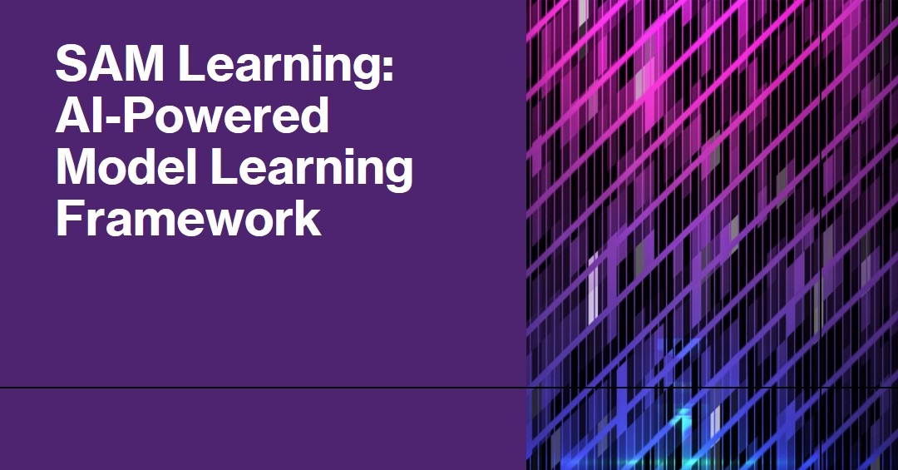

# Safe Action Model Learning Framework
SAM learning algorithms for multiple purposes.

## Notice
This code is NOT the published research and contains underdeveloped code.
Please contact me if you want to use this code for research purposes.

## Features

The SAM-Learning framework is a multi-purpose framework for learning safe action models. 
It is designed to be used in a wide range of scenarios, including:
* Learning safe action models in **discrete** settings.
* Learning safe action models in **continuous** settings. (AAAI 2023)
* Learning safe action models for domains with **conditional and universal effects**. (ICAPS 2024)
* Support for online (partial) learning of action models. 
* Learning agents' action models from **joint concurrent multi-agent** observations.
* Future work: Much more to come!

In addition to the above, the code contains additional functionality designated for model diagnosis purposes.

## Installation

### Pre-requisites

The following are the pre-requisites for the SAM-Learning framework:
* Python 3.10 or higher.
* Installing all the dependencies using the requirements.txt file.
  * Most of the framework is dependent on the pddl-plus-parser package so it is important to install it.
  * The pddl-plus-parser package can be found [here](https://pypi.org/project/pddl-plus-parser/) and can be installed using `pip install pddl-plus-parser`.
* The code is dependent on the following external tools:
  * Metric-FF planner.
  * ENHSP planner.
  * VAL - the plan validation algorithm.
  * Fast Downward planner.

Next we provide some information on the external tools and their installation process.

### Needed external tools:
1. **ENHSP solver** - Numeric planner. Supports polynomial planning. Can be downloaded from [here](https://gitlab.com/enricos83/ENHSP-Public). 
   1. **Note** - In the latest version of the code we tested the algorithm using the latest version of ENHSP (compiled from the source code).
   2. ENHSP has some issues with large domains, to avoid these issues we recommend using the `-gro naive` flag when running the algorithm.
2. **Metric-FF planner** - Numeric planner (only supports linear planning). Can be downloaded from [here](https://fai.cs.uni-saarland.de/hoffmann/metric-ff.html). 
   1. We use version 2.1 of Metric-FF which is the latest version (although we created a version that enables numeric tolerance).
3. **VAL plan validation algorithm** - can be downloaded from [here](https://github.com/KCL-Planning/VAL). Use the instructions given in the repository to install VAL.
4. **Fast Downward planner** - Discrete planner, used for the conditional effects experiments as well as the multi-agent ones. Can be downloaded from [here](https://www.fast-downward.org/HomePage).
5. **Plan Miner** - The plan miner algorithm is used for learning numeric action models from observations. The code can be found [here](https://github.com/Leontes/PlanMiner). 
   1. The code is written in C++ and needs to be compiled using the provided instructions.
   2. The compiled code should be placed in the bin directory of the PlanMiner directory.
   3. Only needed when you want to execute the numeric experiments and perform a comparison against it.

### Environment variables

* 'METRIC_FF_DIRECTORY': Directory of the compiled metric-FF planner.
  * \<path to containing directory>/Metric-FF-v2.1/
* 'FF_DIRECTORY': Directory of the compiled Fast Forward planner.
  * \<path to containing directory>/FF-v2.3/
* 'ENHSP_FILE_PATH': Path to the compiled ENHSP planner (the jar file).
  * \<path to containing directory>/enhsp.jar
* 'CONVEX_HULL_ERROR_PATH': Path to the file that will contain the errors raised from the convex hull algorithm. Used for future debugging purposes.
  * \<path to containing directory>/convex_hull_error.txt
* 'PLAN_MINER_DIR_PATH': Path to the directory that contains the compiled PlanMiner algorithm (bin directory).
  * \<path to containing directory>/PlanMiner/bin/
* 'VALIDATOR_DIRECTORY': Directory containing VAL compiled code.
  * \<path to containing directory>/VAL/
* 'FAST_DOWNWARD_DIR_PATH': The directory containing the compiled Fast Downward planner.
  * \<path to containing directory>/fast-downward-22.06/
* 'PLAN_MINER_DIR_PATH': The directory containing the compiled Plan Miner learning algorithm. Only relevant for numeric experiments.
  * \<path to containing directory>/PlanMiner/bin/

### Code initialization

* Clone the content of the repository from [GitHub](https://github.com/argaman-aloni/sam_learning.git).
* Install the dependencies using `pip install -r requirements.txt`.
* Set the required environment variables.
* Run the tests using `pytest` on the code to validate the installation.

## Usage

The SAM-Learning framework is designed to be used in a wide range of scenarios.
We divide the usage of the framework into two main categories:
* Lifted discrete action models.
* Continuous action models [here](documentation/numeric-sam.md).
* Multi-Agent action models (learned as a combined model) [here](documentation/ma-sam.md).
* Models containing conditional and universal effects.

## License

This work is licensed under the MIT License.